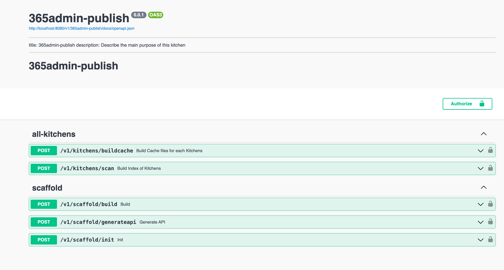

#

# 365admin-publish

This kitchen is used to generate the REST API and CLI for any kitchen

```bash
365admin-publish

Usage:
  365admin-publish [command]

Available Commands:
  completion  Generate the autocompletion script for the specified shell
  help        Help about any command
  serve       Serve the API

Flags:
  -h, --help   help for 365admin-publish

Use "365admin-publish [command] --help" for more information about a command.
`````


## Serve
``` 
365admin-publish serve
2024/02/07 09:22:15 Server started, read documentation at http://localhost:8080/v1/365admin-publish/docs
```


# koksmat-scaffold
